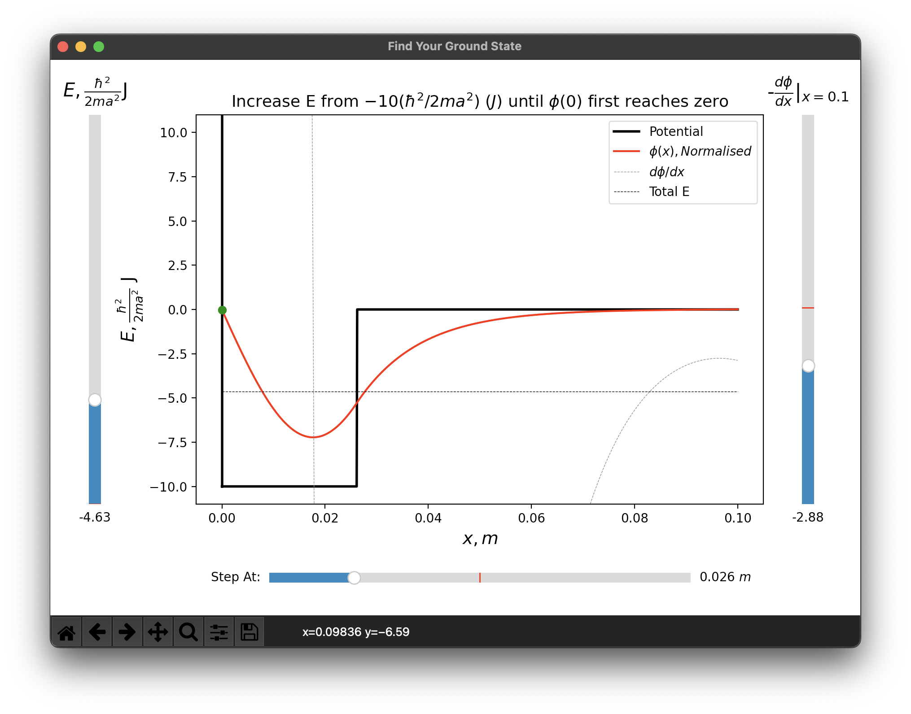
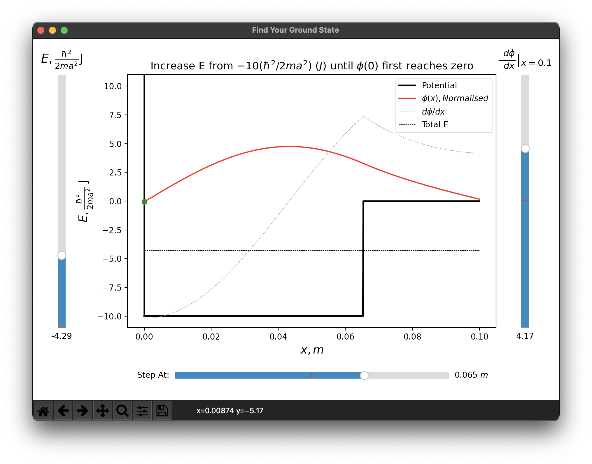
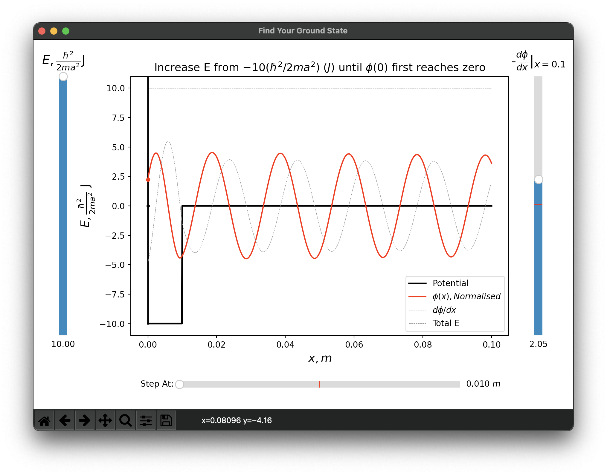

# Solving Differential Equations

Solving the 1D time-independent Schrödinger equations given a set of boundary and initial conditions, E, V and d(psi)/dx.

## Overview

The purpose of this program is to find the ground energy of the wave. My approach was to give the user a slider, which starts from E = 0 and can be gradually increased until the wave first meets the boundary conditions.

This is to simplify the code by identifying what the user can do trivially but hard to implement with the code. The result of it is that the entire code, including the shooting method, visualisation and all the comments, is only 235 line-long.

## Demo

The user is given control to three slider bars for adjusting E, V and -phi'.

When the left-end of the wave meets the boundary condition, the indicator changes to green. The user needs to find the first such point (lowest E allowed).

Keep increasing the energy (because you can) roughly forms the plane wave if the potential well is narrow enough, an evidence that the differential equation solver is implemented correctly.
