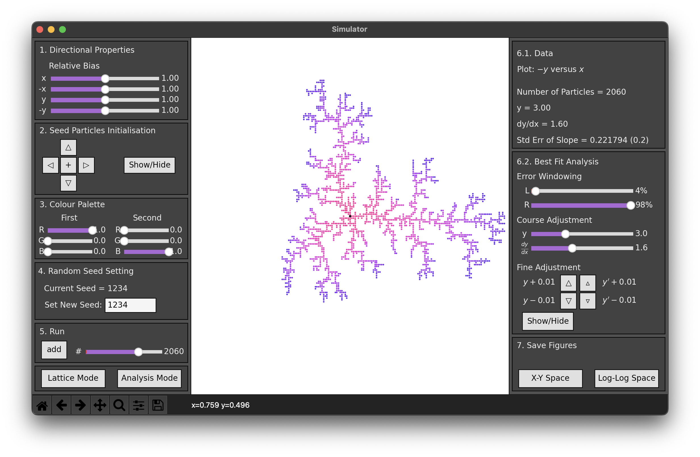
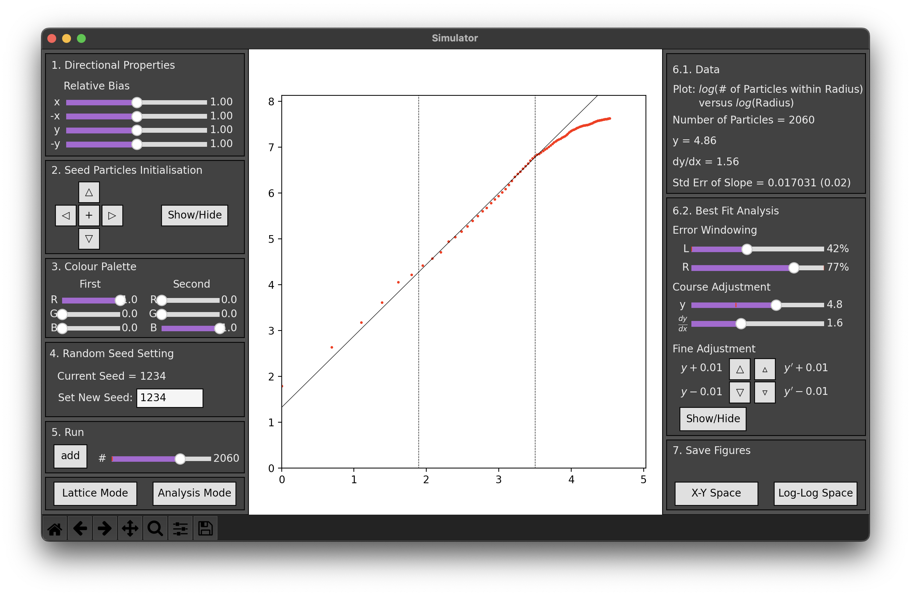

# Individual Project

Final project for the module. I chose diffusion limited aggregation.

## Overview

A particle can perform random walks until it discovers a neighbouring particle, in which case it will stick to it (no random walk after that point). My project was to simulate the aggregation process with a large number of particles and measure the effective dimension of the aggregation structure.

My idea was to make a full-stack program that is  not only a simulation tool but also an analysis tool. With my program, I was able to measure the effective dimension of 2D random aggregations close to the expected value (expected 1.657 +/- 0.004 \[1\], measured 1.66 +/- 0.02).

## Program Demo

The 'Lattice view' of the program. The panels on the left-hand side are used to control the Lattice plane and simulate particles.

The 'Analysis view' of the program. The panels on the right-hand side can be used measure the slope of the log-log plot (radius R versus the number of particles within R). The sum square error is calculated automatically within the set windowing range.

## References

[1] Diffusion-Limited Aggregation, a Kinetic Critical Phenomenon, T. A. Witton et al, 1981.