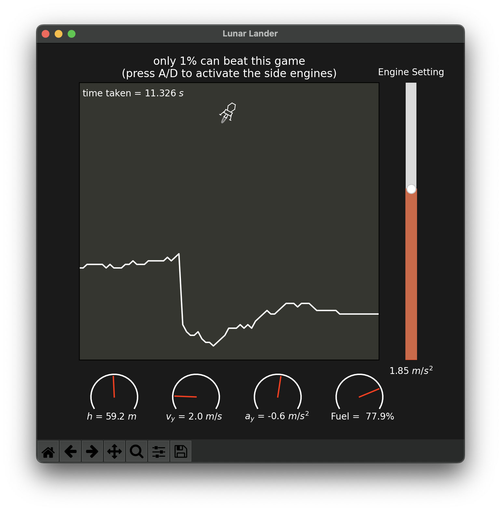
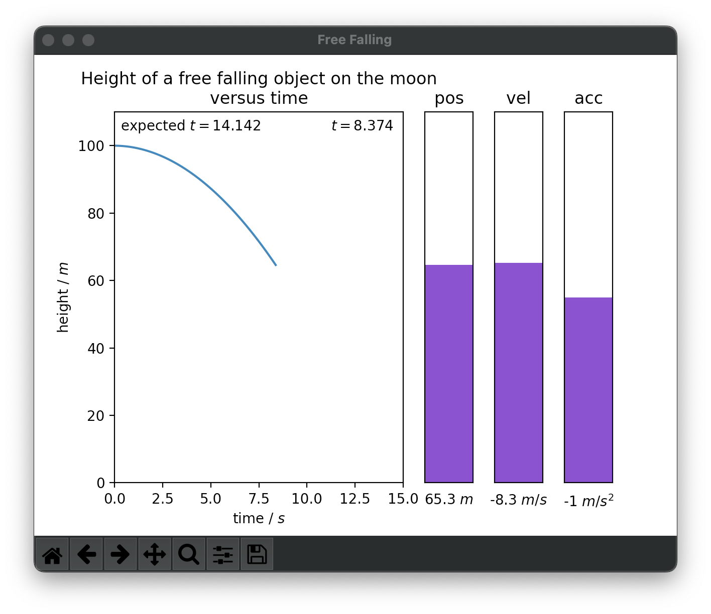
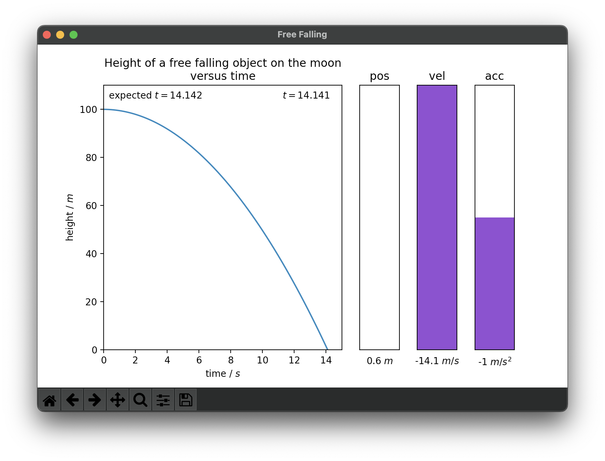

# Lunar Lander Minigame

## Lunar Lander

A minigame with an element of physics (free-falling with differentiable acceleration and momentum in the x direction). The goal is to find and land on a relatively flat surface before running out of fuel.

* Dark mode by default.
* Controllable engine using the slider bar.
* The "engine flame" changes according to the engine strength (looks convincing as the flame model is non-linear).
* Mathematically-engineered randomised terrain that continues infinitely.
* Flight panel style graphics that function.
* Motivating comment displayed above the map.

## Free-fall Analysis

A simple tool that visualises the path of a free-falling object with a = -1 m/s^2.

