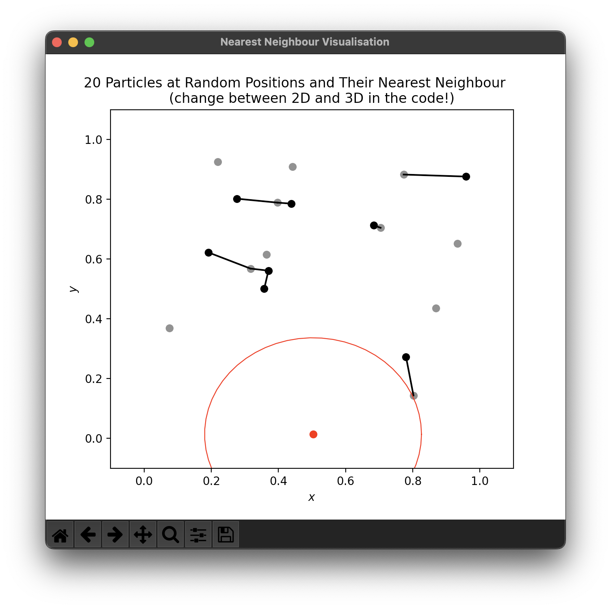
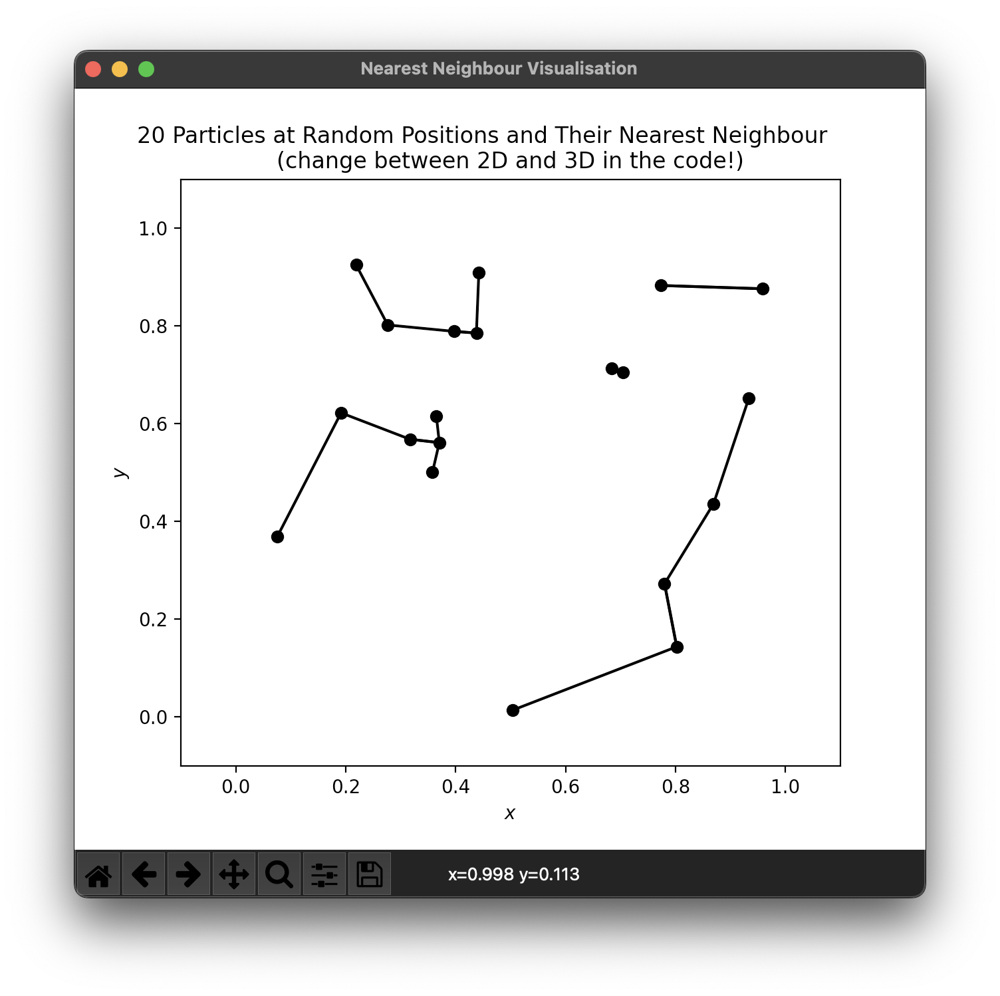
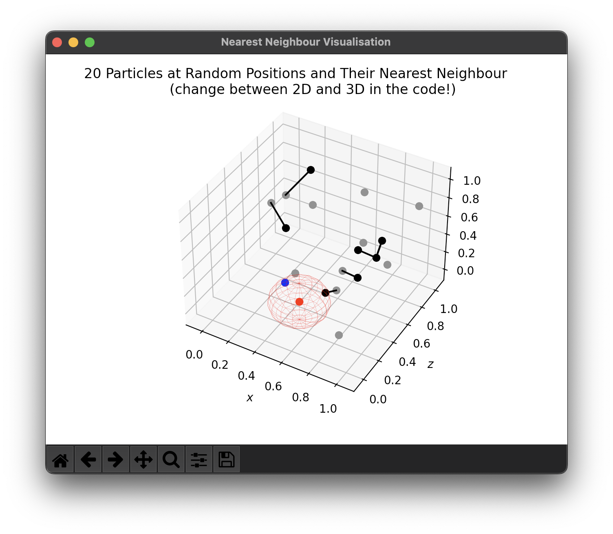
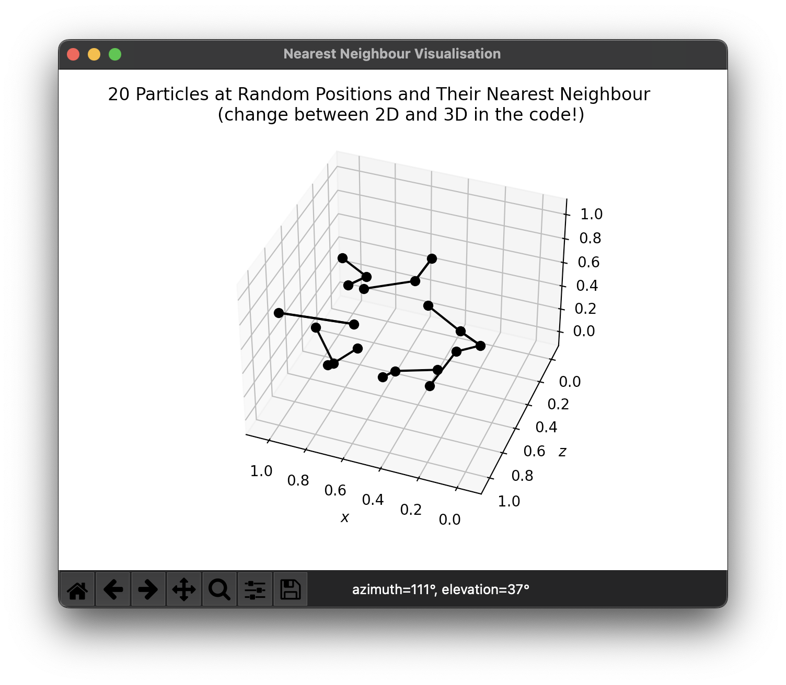

# Nearest-Neighbour Search

This project was to learn how to use Git and GitHub.

## "Technical" Details
* Uses brute-force search, that is, O(n^2).
* I tried making my own K-d tree class as using the default one was not allowed, but ended up not using it.
* Includes 2D and 3D search and visualisations.

## 2D

The visualiser picks a point and draws a circle with an increasing radius, which increases until the circumference touches another point, the nearest neighbour.

The searching is not actually done by drawing circles; it is only to visualise what the code is for. The results are pre-calculated by other part of the code.

Screenshot taken while it is running:

Result:

## 3D

Same as the 2D version, but draws a sphere. The 3D plot rotates slowly as it initially did not give the sense of 3D space with a constant "camera" angle.

Drawing the sphere:

Result:

