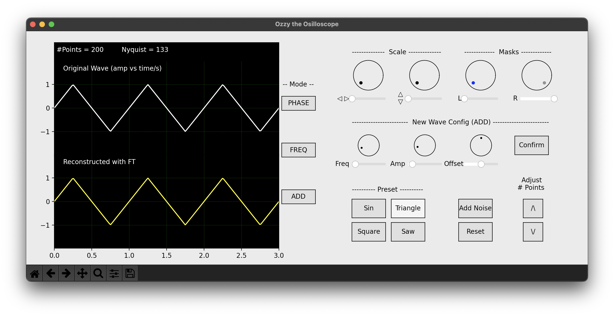
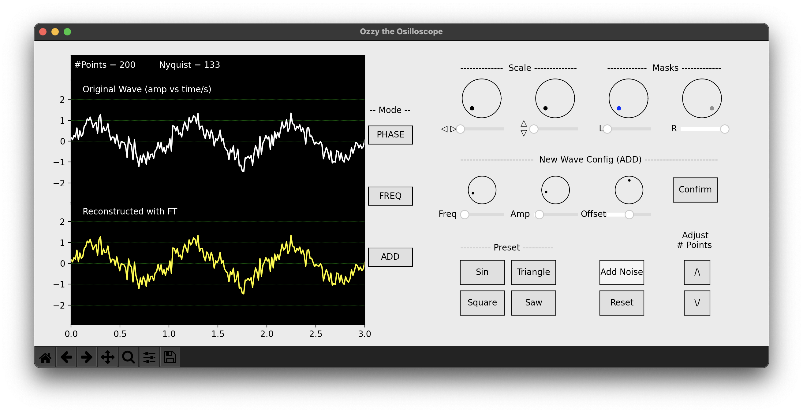
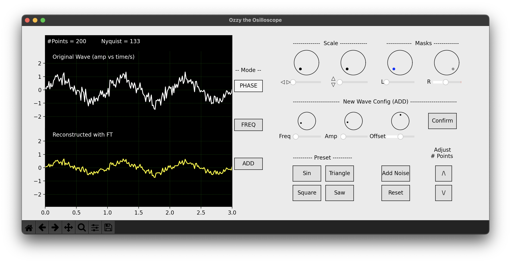

# Signal Processing Project

## Overview

The requirement of this project was to implement a Fast Fourier Transformation (FFT) algorithm for general waves. The result of the FFT can then be used to filter out certain frequency, etc.

My approach was to make a program with the interface of an oscilloscope. Features include:
* Phase, Frequency and Adder mode on the screen.
* Scale buttons used to zoom in/out on the phase/frequency plane.
* Windowing dials used to exclude some part of phase/frequencies.

## Demo

Choose a wave from the preset (sin, triangle, square, saw-tooth), or make a new one using the Add dials.

Add random noise using the Add Noise button.

Display the Frequency plane and filter out certain frequencies using the Masks dials.

The filtered signal can be checked in the Phase mode.

Generate custom waves using the Add dials.

